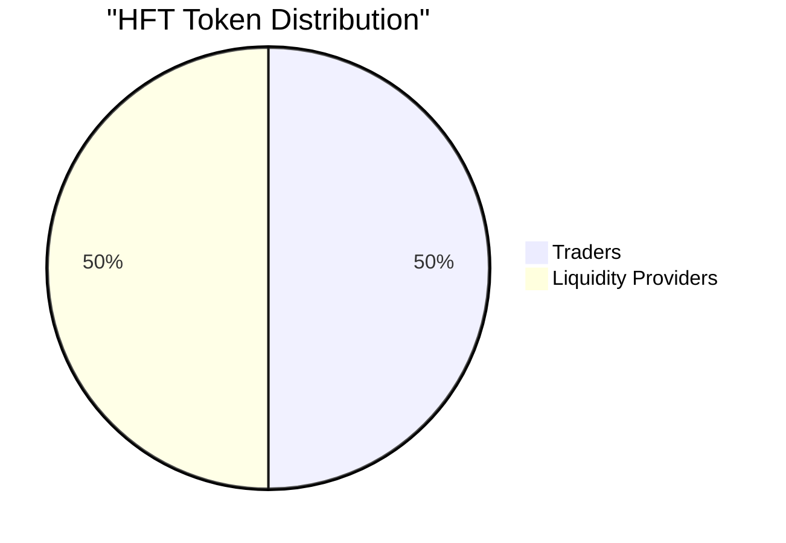

# HFT Tokenomics

The HFT token is designed to power the hft.studio ecosystem, providing utility and governance capabilities to its holders.

## Core Features

### Platform Currency
- Native cryptocurrency of the hft.studio platform
- Required for accessing premium features
- Integral part of the platform's ecosystem

### Token Emission
- Tokens are emitted for every order filled through hft.studio
- Initial emission rate: 1 HFT token per $1 of trading volume
- Automatic distribution through smart contracts

### Token Distribution

- 50% distributed to active traders
- 50% allocated to liquidity providers via Aerodome incentives

### Future Governance
Once the platform achieves:
- $10M monthly trading volume
- Sustained for 6 consecutive months

Staking program will be introduced allowing holders to vote on:
- Token use cases
- Emission rates
- Platform development
- Other governance proposals
